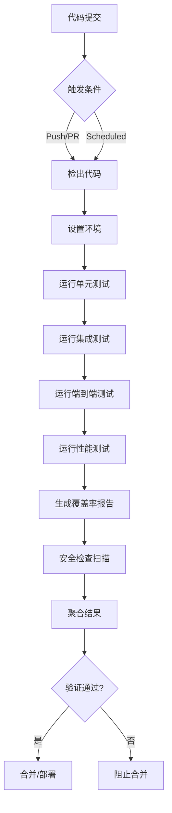

# 智能电网负荷预测系统 - 测试指南

🌩️ **版本**: 1.0.0 | **最后更新**: 2024年

---

## 📋 目录

- [概述](#overview)
- [测试架构](#test-architecture)
- [快速开始](#quick-start)
- [测试类型详解](#test-types)
- [运行测试](#running-tests)
- [覆盖率报告](#coverage-reports)
- [性能测试](#performance-testing)
- [异常测试](#exception-testing)
- [CI/CD集成](#ci-cd-integration)
- [最佳实践](#best-practices)
- [故障排除](#troubleshooting)

---

## 🔍 概述 <a name="overview"></a>

本测试套件为智能电网负荷预测系统提供**完整、分层、自动化**的测试覆盖，确保系统在各种场景下的**正确性、稳定性、性能**和**容错能力**。

### 🎯 测试目标

- **功能正确性**: 验证各模块功能符合预期
- **集成稳定性**: 确保模块间接口正常工作
- **端到端可靠性**: 保证完整工作流可用
- **性能达标**: 满足响应时间、吞吐量和资源利用率要求
- **异常处理能力**: 妥善处理各种错误情况和边界条件
- **可维护性**: 提供清晰的测试文档和易于扩展的结构

### 🏗️ 测试金字塔

```
                        端到端测试 (E2E)
                    ↗                      ↖
            集成测试 (Integration)    性能测试 (Performance)
                ↗                              ↖
        单元测试 (Unit)                    异常测试 (Exception)
                ↖______________________________↗
                            测试基础架构
```

---

## 🏛️ 测试架构 <a name="test-architecture"></a>

### 📁 目录结构

```
tests/
├── conftest.py                  # 测试配置和通用夹具
├── test_unit_complete.py        # 单元测试套件
├── test_integration.py          # 集成测试套件
├── test_e2e.py                  # 端到端测试套件
├── test_performance.py          # 性能测试套件
├── test_exception_handling.py   # 异常处理测试套件
├── __init__.py                  # 测试包初始化
└── test_data/                   # 测试数据文件
    ├── sample_weather_data.json
    ├── historical_load_data.csv
    └── mock_responses/
```

### 🧩 核心组件

| 组件 | 职责 | 依赖 |
|------|------|------|
| `conftest.py` | 全局测试配置、通用夹具、测试数据生成 | pytest, pandas, numpy |
| `test_runner.py` | 测试执行协调、报告生成 | pytest, coverage |
| `pytest.ini` / `pyproject.toml` | 测试配置 | 项目配置 |

---

## 🚀 快速开始 <a name="quick-start"></a>

### 1️⃣ 安装依赖

```bash
# 安装测试依赖
pip install -r realtime_api/requirements.txt
pip install pytest pytest-cov pytest-asyncio pytest-mock
pip install pytest-benchmark coverage codecov
```

### 2️⃣ 运行基本测试

```bash
# 运行所有测试
python test_runner.py --all

# 仅运行单元测试
python test_runner.py --unit

# 运行集成测试
python test_runner.py --integration
```

### 3️⃣ 查看结果

```bash
# 查看覆盖率报告
open coverage_html/index.html

# 查看详细测试报告
open test_execution_report.html
```

---

## 🧪 测试类型详解 <a name="test-types"></a>

### 🔹 单元测试 (Unit Tests)

**文件**: `tests/test_unit_complete.py`

**目的**: 测试单个组件的内部逻辑和功能。

**特点**:
- ✅ 快速执行 (秒级)
- ✅ 高覆盖率目标 (>90%)
- ✅ 隔离测试 (使用Mock)
- ✅ 重点测试边界条件和错误路径

**主要测试类**:

| 组件 | 测试内容 | 关键断言 |
|------|---------|----------|
| `TestWeatherValidator` | 数据验证、异常检测、质量评分 | 质量分数、异常标记准确性 |
| `TestFeatureGenerator` | 特征生成、滞后特征、滚动统计 | 特征维度、统计特性 |
| `TestNormalizationAdapter` | 特征归一化、逆变换 | 值范围、维度一致性 |
| `TestSolarEstimator` | 光伏发电估算、温度影响 | 输出合理性、边界条件 |
| `TestNetLoadCalculator` | 净负荷计算、异常处理 | 计算准确性、错误处理 |
| `TestMonitoringService` | 指标收集、告警生成 | 准确性、阈值响应 |

### 🔹 集成测试 (Integration Tests)

**文件**: `tests/test_integration.py`

**目的**: 验证多个组件之间的协作和数据流。

**特点**:
- ✅ 中等执行时间 (分钟级)
- ✅ 端到端数据流验证
- ✅ API接口测试
- ✅ 真实场景模拟

**主要测试类**:

| 测试类 | 验证内容 | 关键场景 |
|--------|---------|----------|
| `TestPredictionPipeline` | 完整预测管道 | 数据质量影响、多模型集成 |
| `TestAPIServiceIntegration` | API端点集成 | 请求验证、响应格式 |
| `TestDataFlowIntegration` | 数据流处理 | 多位置、多维特征 |
| `TestServiceIntegration` | 外部服务集成 | OpenMeteo、模型推理 |

### 🔹 端到端测试 (E2E Tests)

**文件**: `tests/test_e2e.py`

**目的**: 验证系统完整工作流从输入到输出的正确性。

**特点**:
- ✅ 缓慢执行 (10+分钟)
- ✅ 真实用户场景
- ✅ 系统级别验证
- ✅ 历史数据回测

**主要测试类**:

| 测试类 | 验证内容 | 关键场景 |
|--------|---------|----------|
| `TestFullWorkflow` | 完整工作流 | 气象→预测→输出生命周期 |
| `TestBackTesting` | 历史数据回测 | 准确性评估、滚动预测 |
| `TestSystemRobustness` | 系统健壮性 | 并发处理、长时间运行 |

### 🔹 性能测试 (Performance Tests)

**文件**: `tests/test_performance.py`

**目的**: 评估系统在各种负载下的性能指标。

**特点**:
- ✅ 性能基准建立
- ✅ 并发能力评估
- ✅ 资源利用监控
- ✅ 内存泄漏检测

**关键测量指标**:

| 指标 | 目标 | 测量方法 |
|------|------|----------|
| API响应时间 | <2秒 | 多请求平均、最大、最小值 |
| 并发处理能力 | >100 QPS | 并发线程、成功率 |
| 特征生成性能 | <100ms/1000h | 不同数据规模 |
| 内存使用 | <500MB | RSS监测、泄漏检测 |
| CPU效率 | <70% | 利用率监控 |

### 🔹 异常处理测试 (Exception Tests)

**文件**: `tests/test_exception_handling.py`

**目的**: 验证系统在异常情况下的错误处理和恢复能力。

**测试场景覆盖**:

| 异常类型 | 场景示例 | 期望行为 |
|----------|----------|----------|
| 网络异常 | API超时、连接失败、DNS错误 | 降级处理、错误响应、重试 |
| 数据质量异常 | 无效数据、缺失字段、格式错误 | 数据清洗、质量报告、异常捕获 |
| 模型服务异常 | 服务不可用、预测超时、内存不足 | 服务降级、缓存回退、错误响应 |
| API异常 | 无效请求、大负载、速率限制 | 验证错误、限流控制 |
| 系统异常 | 内存泄漏、CPU过载 | 资源管理、自动恢复 |

---

## ▶️ 运行测试 <a name="running-tests"></a>

### 🎯 使用测试运行器

推荐的运行方式是使用 `test_runner.py`，它提供了统一的测试管理和报告生成。

```bash
# 运行所有测试类型
python test_runner.py --all

# 运行特定测试类型
python test_runner.py --unit --coverage
python test_runner.py --integration
python test_runner.py --e2e --html

# 运行性能测试和基准
python test_runner.py --performance --benchmark

# 运行异常处理测试
python test_runner.py --exception --verbose

# 组合运行
python test_runner.py --unit --integration --coverage --html
```

### 🔧 直接使用pytest

```bash
# 运行特定测试文件
pytest tests/test_unit_complete.py -v

# 按标记运行测试
pytest -m "unit" tests/
pytest -m "integration" tests/
pytest -m "e2e" tests/
pytest -m "performance" tests/
pytest -m "exception" tests/

# 运行特定标记组合
pytest -m "unit or integration" tests/
pytest -m "not slow" tests/

# 详细输出和短跟踪
pytest tests/test_unit_complete.py -v --tb=short

# 失败重跑
pytest tests/ --tb=short -x --reruns 2 --reruns-delay 1
```

### 🎛️ 命令行选项详解

#### 常用pytest选项

| 选项 | 描述 |
|------|------|
| `-v, --verbose` | 详细输出，显示每个测试函数名 |
| `-s` | 显示标准输出 (print语句) |
| `--tb=short` | 简洁的跟踪信息 |
| `--tb=line` | 每行一个跟踪 |
| `-x` | 第一个失败就停止 |
| `--maxfail=N` | 最多失败N次后停止 |
| `-k "expression"` | 按关键字选择测试 |
| `-m "marker"` | 按标记选择测试 |

#### 覆盖率选项

| 选项 | 描述 |
|------|------|
| `--cov=SOURCE` | 测量指定源的覆盖率 |
| `--cov-report=html` | 生成HTML报告 |
| `--cov-report=xml` | 生成XML报告 |
| `--cov-report=term-missing` | 在终端显示缺失行 |
| `--cov-fail-under=MIN` | 覆盖率低于MIN时失败 |

#### 性能测试选项

| 选项 | 描述 |
|------|------|
| `--benchmark-only` | 仅运行基准测试 |
| `--benchmark-json=FILE` | 将结果保存到JSON文件 |
| `--benchmark-columns=COLS` | 指定显示列 |

---

## 📈 覆盖率报告 <a name="coverage-reports"></a>

### 📊 生成覆盖率报告

```bash
# 生成多格式覆盖率报告
python test_runner.py --all --coverage

# 仅生成覆盖率报告 (已有.coverage文件)
python -m coverage html -d coverage_html
python -m coverage xml -o coverage.xml
python -m coverage report --precision=2
```

### 📋 报告解读

**HTML报告 (`coverage_html/index.html`)**:
- 🚥 红/绿/黄编码显示覆盖率级别
- 📊 每个文件和函数的详细覆盖率
- 🔍 支持点击查看详细未覆盖代码

**XML报告 (`coverage.xml`)**:
- 🤖 CI/CD系统集成格式
- 📈 可被SonarQube、Codecov等工具读取

**终端报告**: 
- 📊 简洁的汇总信息
- ✅ 快速查看覆盖率状态

### 🎯 覆盖率目标

| 模块类型 | 覆盖率目标 | 描述 |
|----------|------------|------|
| 核心算法 | 95%+ | 数据验证、特征工程等 |
| API服务 | 90%+ | FastAPI端点和路由 |
| 预测模型 | 85%+ | 模型推理和集成 |
| 工具类 | 80%+ | 辅助函数和工具 |
| 配置文件 | N/A | 配置和文档文件 |

---

## ⚡ 性能测试 <a name="performance-testing"></a>

### 📊 运行基准测试

```bash
# 运行性能测试基准
python test_runner.py --performance --benchmark

# 仅运行基准测试
python -m pytest tests/test_performance.py --benchmark-only

# 生成基准JSON报告
python -m pytest tests/test_performance.py --benchmark-json=benchmark.json
```

### 📈 关键性能指标

#### API响应时间
- **单个请求**: < 500ms
- **平均响应**: < 1000ms  
- **峰值响应**: < 3000ms

#### 并发处理能力
- **轻负载 (10并发)**: > 95% 成功率
- **中等负载 (50并发)**: > 90% 成功率
- **高负载 (100并发)**: > 85% 成功率

#### 资源利用率
- **CPU使用**: < 70%
- **内存使用**: < 500MB
- **磁盘I/O**: 最小化

#### 批处理性能
- **特征生成 (1000h数据)**: < 2秒
- **模型推理 (单请求)**: < 200ms
- **数据验证 (24h数据)**: < 100ms

### 🔍 性能分析工具

```python
# 在测试中测量执行时间
start_time = time.perf_counter()
# ... 执行操作 ...
end_time = time.perf_counter()
execution_time = end_time - start_time

# 内存使用监控
import psutil
process = psutil.Process()
memory_mb = process.memory_info().rss / 1024 / 1024

# CPU使用率
cpu_percent = psutil.cpu_percent(interval=1)
```

---

## 🚨 异常测试 <a name="exception-testing"></a>

### 🔧 运行异常测试

```bash
# 运行所有异常处理测试
python test_runner.py --exception

# 详细输出
python -m pytest tests/test_exception_handling.py -v -s

# 特定异常场景
python -m pytest -k "timeout" tests/test_exception_handling.py
python -m pytest -k "network" tests/test_exception_handling.py
```

### 🛡️ 异常类型覆盖

#### 1. 网络异常

| 场景 | 测试方法 | 期望行为 |
|------|----------|----------|
| API超时 | Mock超时异常 | 超时处理、降级响应 |
| 连接失败 | 模拟网络错误 | 错误报告、重试机制 |
| DNS解析失败 | 模拟解析异常 | 快速失败、错误日志 |

#### 2. 数据质量异常

| 场景 | 测试数据 | 期望行为 |
|------|----------|----------|
| 无效数值 | -200°C温度、150%湿度 | 数据验证、异常检测 |
| 缺失字段 | None值、空字符串 | 默认处理、错误报告 |
| 格式错误 | 字符串数字、非法时间 | 格式转换、类型检查 |

#### 3. 服务异常

| 场景 | 测试方法 | 期望行为 |
|------|----------|----------|
| 模型不可用 | 模拟服务异常 | 服务降级、缓存回退 |
| 内存不足 | 模拟内存错误 | 资源管理、优雅降级 |
| 预测超时 | 增加处理延时 | 超时控制、异步处理 |

### 📝 错误处理验证

```python
# 验证异常处理
with pytest.raises(HTTPException) as exc_info:
    api_call_with_invalid_data()
    
assert exc_info.value.status_code == 400
assert "invalid" in str(exc_info.value.detail).lower()

# 验证降级策略
def test_service_degradation():
    # 模拟主要服务不可用
    with patch('main_service') as mock_service:
        mock_service.side_effect = Exception("服务不可用")
        
        # 调用降级后的功能
        response = fallback_service_call()
        
        # 验证降级功能正常
        assert response.status_code == 200
        assert response.get('degradation_level') == 'medium'
```

---

## 🔄 CI/CD集成 <a name="ci-cd-integration"></a>

### 🚀 GitHub Actions配置

完整的CI/CD流水线位于 `.github/workflows/ci-cd.yml`。

**触发条件**:
- ✅ 代码推送 (main, develop分支)
- ✅ Pull Request提交
- ⏰ 每周定时执行 (周日2点)
- 🎯 手动触发

**执行任务**:
1. **单元测试** - 所有Python版本
2. **集成测试** - 服务间测试
3. **端到端测试** - 完整工作流
4. **性能测试** - 基准建立
5. **异常测试** - 错误处理验证
6. **覆盖率报告** - 聚合和验证
7. **安全检查** - 依赖和代码扫描
8. **总结报告** - 生成汇总文档

### 📊 持续集成流程



### 🌐 集成工具

| 工具 | 用途 | 配置 |
|------|------|------|
| **Codecov** | 代码覆盖率监控 | `codecov.yml` |
| **SonarQube** | 代码质量分析 | `sonar-project.properties` |
| **Security** | 安全扫描 | `bandit`, `safety` |
| **Benchmarks** | 性能基线 | `pytest-benchmark` |

---

## 💡 最佳实践 <a name="best-practices"></a>

### 🔧 编写高质量测试

#### 单元测试最佳实践

1. **单一职责**: 每个测试只验证一个功能
2. **清晰命名**: 使用描述性测试函数名
3. **AAA模式**: Arrange-Act-Assert
4. **避免依赖**: 使用Mock隔离外部依赖
5. **合理断言**: 验证期望结果和行为

```python
def test_weather_validation_high_quality_data():
    # Arrange - 准备测试数据
    weather_validator = WeatherDataValidator()
    high_quality_data = generate_test_weather_data(scenario='normal')
    
    # Act - 执行被测功能
    clean_df, quality_report, _ = weather_validator.validate(high_quality_data)
    
    # Assert - 验证结果
    assert len(clean_df) > 0, "应保留有效数据"
    assert quality_report.overall_score > 0.8, "高质量数据应获得高分"
```

#### 集成测试最佳实践

1. **测试真实场景**: 模拟用户工作流程
2. **数据流验证**: 验证数据在系统中的流转
3. **边界条件**: 测试各种输入组合
4. **清理资源**: 测试完成后清理临时数据

#### 性能测试最佳实践

1. **建立基准**: 记录初始性能指标
2. **监控变化**: 检测性能退化
3. **资源分析**: 监控内存、CPU使用率
4. **可重复性**: 多次运行确保结果稳定

### 📈 测试数据管理

```python
# 使用测试数据生成器
class TestDataGenerator:
    def generate_weather_data(self, hours, locations, scenario):
        """生成气象测试数据"""
        pass
    
    def generate_historical_load_data(self, hours):
        """生成历史负荷数据"""
        pass

# 在测试中复用数据
def test_with_realistic_data():
    generator = TestDataGenerator()
    weather_data = generator.generate_weather_data(
        hours=24, locations=['Boston'], scenario='normal'
    )
    # ... 执行测试 ...
```

### 🔄 测试维护策略

1. **定期审查**: 每季度审查测试有效性
2. **删除过时的测试**: 移除不再相关的测试
3. **添加新测试**: 新功能必须有对应测试
4. **简化复杂测试**: 重构难以理解的测试
5. **文档更新**: 保持测试文档同步

---

## 🔧 故障排除 <a name="troubleshooting"></a>

### ❌ 常见问题解决

#### 测试失败 - 环境问题

```bash
# 问题: 模块导入失败
# 解决: 检查Python路径
export PYTHONPATH="${PYTHONPATH}:$(pwd)"
python -c "import sys; print('\n'.join(sys.path))"

# 问题: 依赖冲突
# 解决: 创建干净的虚拟环境
python -m venv test_env
source test_env/bin/activate
pip install -r requirements.txt
```

#### 测试失败 - 数据问题

```bash
# 问题: 测试数据生成不一致
# 解决: 检查随机种子
np.random.seed(42)  # 在测试中设置固定种子

# 问题: 文件路径错误
# 解决: 使用绝对路径
import os
current_dir = os.path.dirname(os.path.abspath(__file__))
```

### 📞 寻求帮助

#### 测试执行问题

```bash
# 获取详细日志
python -m pytest tests/ -v -s --tb=long

# 只运行失败的测试
python -m pytest tests/ --tb=short -x --reruns 2

# 调试单个测试
python -m pytest tests/test_file.py::TestClass::test_method -v -s
```

#### 环境配置问题

```bash
# 检查Python版本
python --version

# 检查依赖安装
pip list | grep pytest
pip show fastapi  

# 验证测试文件存在
ls -la tests/
```

### 📋 错误代码列表

| 代码 | 含义 | 解决方案 |
|------|------|----------|
| E001 | 模块导入错误 | 检查PYTHONPATH和依赖 |
| E002 | 测试数据缺失 | 确认测试数据文件存在 |
| E003 | 覆盖率不足 | 增加测试覆盖更多代码 |
| E004 | 性能基准失败 | 优化代码或调整基准 |
| E005 | API连接失败 | 检查网络配置和服务状态 |

---

## 📚 相关资源

### 📖 官方文档

- [PyTest官方文档](https://docs.pytest.org/)
- [Coverage.py文档](https://coverage.readthedocs.io/)
- [FastAPI测试指南](https://fastapi.tiangolo.com/tutorial/testing/)
- [Python单元测试](https://docs.python.org/3/library/unittest.html)

### 🔗 有用链接

- [GitHub Actions文档](https://docs.github.com/actions)
- [Codecov集成指南](https://docs.codecov.com/)
- [性能测试最佳实践](https://pytest-benchmark.readthedocs.io/)

### 📚 推荐工具

- **VS Code**: Python扩展 + Test Explorer
- **PyCharm**: 内置测试运行器
- **GitHub Codespaces**: 云测试环境
- **Docker**: 容器化测试环境

---

## 📝 更新日志

### v1.0.0 (2024-01-XX)
- ✅ 初始版本发布
- ✅ 完整的五层测试架构
- ✅ 自动化测试运行器
- ✅ CI/CD流水线配置
- ✅ 详细测试文档

### 计划中功能
- 🚧 测试结果可视化Dashboard
- 🚧 自动化回归测试
- 🚧 机器学习模型测试
- 🚧 A/B测试框架集成

---

## 🙏 致谢

感谢所有为测试框架做出贡献的开发者和贡献者！

---

🔧 **测试驱动开发，质量保障前行** | 🌩️ *智能电网负荷预测系统*